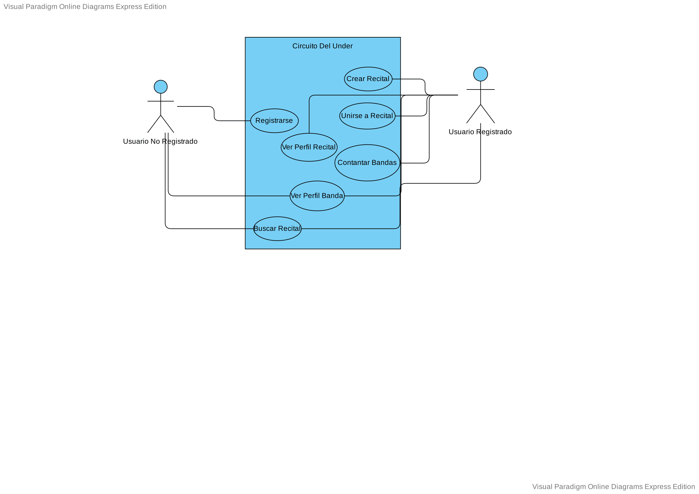

# Diagrama de Casos de Uso

**Registrarse:**
- El usuario debe logearse con facebook
- El sistema validará que las credenciales sean correctas

**Buscar recitales:**
- El usuario elige un genero
- El sistema mostrará la lista de recitales asociadas a ese genero

**Unirse a recital:**
- Luego de que el usuario busca un recital
- El usuario elegirá algun recital disponible para unirse
- El usuario solicita unirse al recital
- El sistema verificara al usuario para poder unirse

**Contactar bandas:**
- El usuario debe crear un recital abierto especifico para que otros usuario puedan participar
- El usuario debe postear el recital

**Ver perfil de recital**:
- Luego de que el usuario elija un recital, podrá acceder al perfil del mismo
- El usuario podrá visualizar los datos especificos del recital

**Ver perfil de banda**:
- Luego de que el usuario elija una banda, podrá acceder al perfil del mismo
- El usuario podrá visualizar los datos especificos de la banda

**Crear recital:**
- Luego que el usuario se registre puede crear un recital con sus datos
