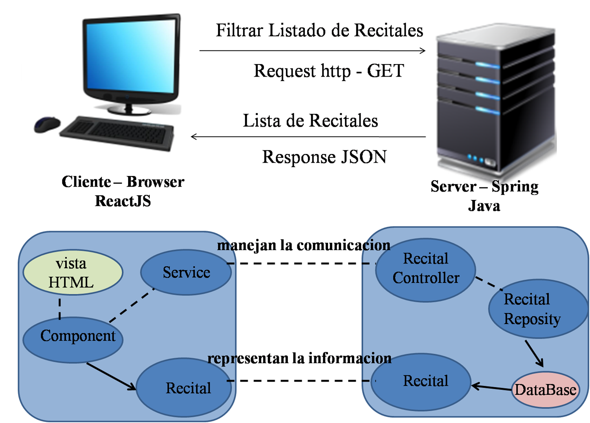

# Prueba de concepto

Nuestra solucion esta separada en 2 proyectos.
+ Modelp del Dominio - (Backend)  [ReadMe](https://github.com/fuser1988/circuitoDelUnder-Backend/blob/master/README.md)
+ Modelo de la Vista - (Frontend) [ReadMe](https://github.com/fuser1988/circuitoDelUnder-Frontend/blob/master/README.md)

## Tarea

como usuario buscar un recital por genero para asistir

## Pasos a seguir

### primer paso 

El usuario ingresa un input con el genero que quiere buscar

### segundo paso

El pedido de busqueda llega al mensaje filterGenero del objeto RecitalController, que es el encargado de resolver el pedido y enviar una respuesta. Si el pedido no tiene resultados devuelve una una lista vacia, y si lo tiene devuelve la cantidad de resultados obtenidos.

````java
	@GetMapping("/recitales/bandas")
	public List<Recital> filterGenero(@RequestParam(value = "genero") String genero) {
		return service.filterGenero(genero);
	}
````

### tercer paso

Despues se devuelve lo pedido para que el componente lea la respuesta

````javaScript
getRecitales() {
        API.get(`recitales`)
            .then(({ data: _recitales }) => {
                this.setState({ recitales: _recitales });
            });
    }
````
aca es donde se lee el resultado y lo muestra 

class GrillaRecitales extends React.Component {

````javaScript
    render() {
        return <>

            {this.props.recitales.map(recital => {
                return <Card className="offset-2 col-md-8" key={recital.id}>
                    <CardTitle>
                        <h1 className="mt-2 mb-0 text-center">{recital.nombre}</h1>
                    </CardTitle>
                    <CardBody className="pb-0">
                        <Row>
                            <Col md="6" className="">
                                
                            </Col>
                            <Col md="6" className="">
                                <h4>{recital.descripcion}</h4>
                                <h3>{recital.lugar}</h3>
                                <h3>{recital.direccion}</h3>
                                <h3>{recital.fecha}</h3>
                                <h3>{recital.hora}</h3>
                            </Col>
                        </Row>
                    </CardBody>
                    <CardFooter>
                    </CardFooter>
                </Card >
            })}
        </>
    }
````
## Extras

 Crear modelo Recital. integrar database Postgresql al proyecto. Integrar tanto el backend como el frontend a heroku.

## Diagrama de Arquitentura



## Dominio
En el Backend vamos a utilizar como lenguaje Java 1.8 y expondremos servicios REST que nos permitirán interactuar con el modelo del dominio y acceder a la DataBase.
Para la persistencia la tecnología seleccionada fue SpringBoot + Postgresql + JPA.

## Vista
En el Frontend consumimos los servicios REST y los manipulamos mediante React.
